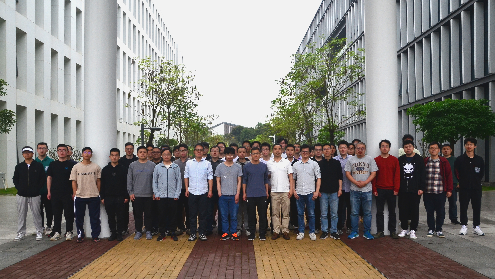

# 东南代数几何研讨会 (IV) April 4 - 9, 2023

[Home](index.md)

[**原始会议链接**](https://math.sustech.edu.cn/conference/12615.html?lang=zh)

## 会议内容

### a)

本次研讨会的主题是：正特征的 non-vanishing 与 abundance 猜想。我们邀请中国科技大学的张磊教授与中国科学院的徐政博士做为主讲人，介绍近年来在此方向的进展（4次）。

### b)

此外我们安排了与此主题相关的 5 次学术报告，报告人为：

1. 龚成（苏州大学）
2. 顾怡（苏州大学）
3. 刘海东（中山大学）
4. 徐政（中国科学院）
5. 周明铄（天津大学）

### c)

为了更好地衔接上述专题，4月7日（周五）下午及晚间，安排有 3 次预热报告，由南科大的博士生介绍相关概念与结论。

## 联系人

- 李展
- 李彤彤（秘书）

- 
