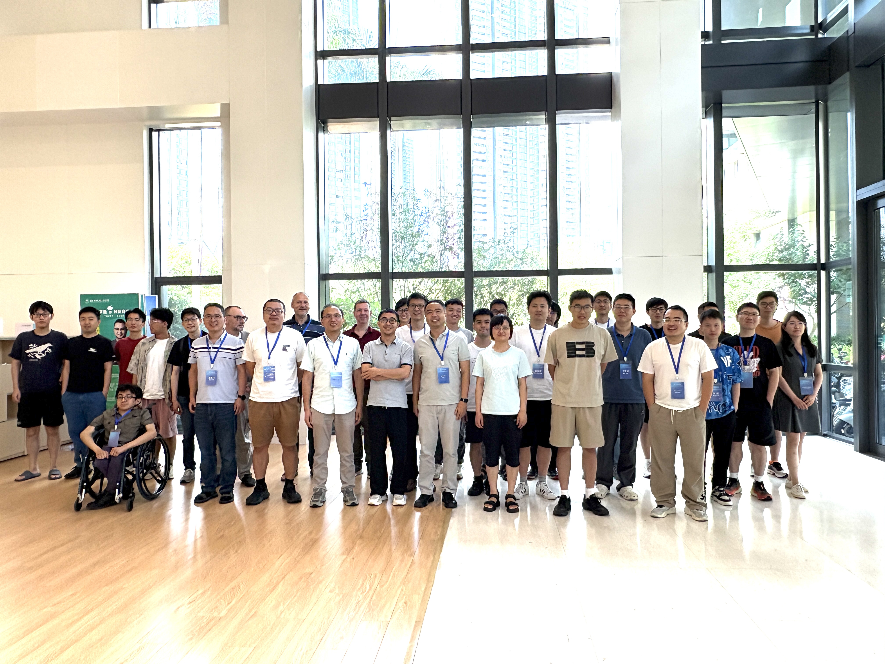

# Southeastern Algebraic Geometry Symposium (VIII)

[Home](index.md)

[**The original website**](https://math.sustech.edu.cn/conference/13283.html)

**Time:** June 9 (Monday)--June 13 (Friday), 2025

**Place:** Southern University of Science and Technology (SUSTech), Shenzhen

**Venue:** Science Building M1001 (June 9-11); Taizhou Building (International Center for Mathematics), ICM Lecture Hall 240 A (June 12-13)

**Organizer:** Zhan Li (SUSTech)

## Speakers

- Florin Ambro (Institute of Mathematics of the Romanian Academy)
- Sung Rak Choi (Yonsei University)
- Kenta Hashizume (Niigata University)
- Zhengyu Hu (Chongqing University of Technology)
- Zheng Hua (University of Hong Kong)
- Chen Jiang (Fudan University)
- Vladimir Lazić (Universität des Saarlandes)
- Jihao Liu (Peking University)
- Yusuke Nakamura (Nagoya University)
- Yuri Prokhorov (Steklov Mathematical Institute)
- Lu Qi (East China Normal University)
- Lei Song (Sun Yat-sen University)
- Hao Sun (South China University of Technology)
- Zhiyu Tian (Beijing International Center for Mathematical Research)
- Chengxi Wang (Tsinghua University)
- Zhixin Xie (Université de Lorraine)
- Jinsong Xu (Xi'an Jiaotong-Liverpool University)
- Zheng Zhang (ShanghaiTech University)
- Chuyu Zhou (Xiamen University)

  
